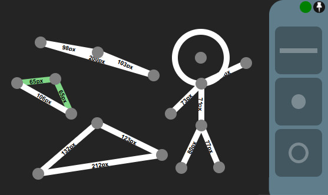

# Triangles

## Purpose
This website was made as a project for Geometry class in 8th grade, to prove the *[Triangle Inequality Theorem](https://en.wikipedia.org/wiki/Triangle_inequality)*:

> For any triangle, the sum of the lengths of any two sides must be greater than or equal to the length of the remaining side.  
*\- (Wikipedia)*

More specifically, that the following inequality is always met for any given degenerate triangle:

**$c \leq a+b$**

The proof here involves constructing a triangle from 3 lines while enabling the *Width Text* option, and seeing that no matter how much we stretch or transform said triangle, the condition above is always to be met.

We can also see the condition of $c = a+b$ by simply pushing the intersection point of the 2 other sides towards the longest side, and seeing the lengths form the equality.

## Other Fluff

I also added a point and a circle shape just to see how far I could stretch my pretty flexy API, which was pretty satisfying lol.

Though the point shape is pretty much useless and the circle is pretty buggy.  
(Not to be fixed or anything.)

### Geometry Panel

The *Geometry Panel* to allow the user to specify geometric relations between different lines - kinda Onshape-style.

- **Equality** - Allows the selection of 2 or more (chianed) lines to be made consistently equal. The re-scaling of one leads to the re-scaling of the other.  
    Any and all equal lines are granted the same, random color.
    - Does not work under Firefox.

- **Parallel** - Makes 2 lines be parallel to one another.  
    This geometry is missing from the `geometry_types.js` implementation, so I can either assume that I did not implement this feature back then or simply forgot to commit it :\(
